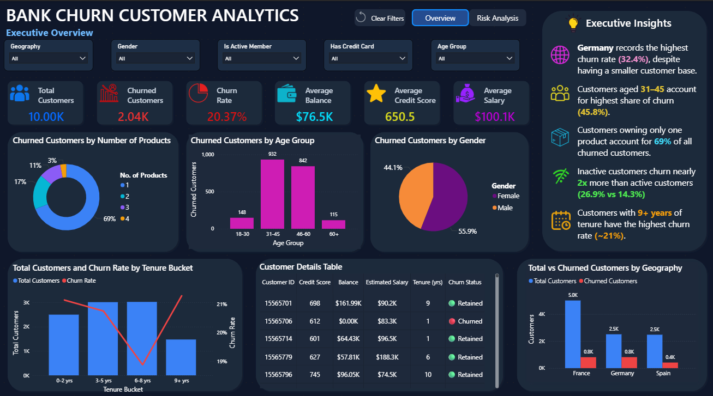
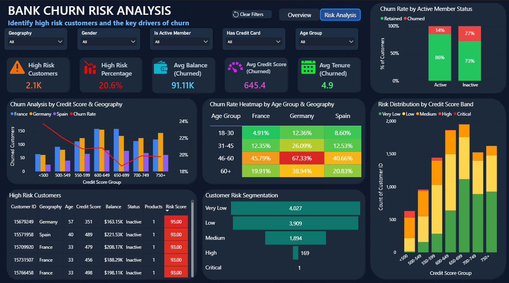

# 🏦 Bank Churn Customer Analytics Dashboard

An interactive **Power BI dashboard** designed to analyze customer churn, uncover key churn drivers, and identify high-risk customers using a custom **Risk Score Model**.

---

# 📌 Project Overview

Customer churn is a critical challenge for banks, as retaining existing customers is significantly more cost-effective than acquiring new ones.

This project analyzes customer behavior and provides actionable insights through two interactive dashboard pages:

- 📊 Executive Overview
- ⚠️ Risk Analysis

---

# 📸 Dashboard Preview

## Executive Overview



---

## Risk Analysis



---

# 🚀 Dashboard Features

### 📊 Executive Overview

- Key Performance Indicators (KPIs)
- Customer Churn Analysis
- Geography-wise Analysis
- Product-wise Analysis
- Age Group Analysis
- Gender Analysis
- Tenure Analysis
- Executive Insights

### ⚠️ Risk Analysis

- Custom Risk Score Model
- Customer Risk Segmentation
- Risk Heat Map
- High-Risk Customer Identification
- Active vs Inactive Customer Analysis
- Top 10 Highest Risk Customers

---

# 📈 Key Insights

✔️ Germany records the highest churn rate despite a smaller customer base.

✔️ Customers aged **31–45** contribute the largest share of churn.

✔️ Customers owning only **one product** account for **69%** of churned customers.

✔️ Inactive customers churn nearly **2×** more than active customers.

✔️ Customers with **9+ years** of tenure show the highest churn rate.

---

# 🛠️ Tools & Skills

**Power BI | Power Query | DAX | Data Modeling | Data Visualization | Conditional Formatting | Bookmarks & Navigation | Interactive Dashboard Design**

---

# 📂 Dataset

The **dataset** folder contains:

- **Bank_Churn_Data.xlsx** – Original customer dataset
- **Data_Dictionary.xlsx** – Description of all dataset columns and their meanings

> **Note:** All data cleaning, transformations, calculated columns, DAX measures, and the custom Risk Score model were developed within Power BI using Power Query and DAX.

---

# 🎯 Project Objectives

- Analyze customer churn patterns.
- Identify high-risk customers using a custom Risk Score.
- Build an interactive executive dashboard.
- Support data-driven customer retention strategies.

---

# 📁 Repository Structure

```text
Bank-Churn-Customer-Analytics
│
├── Bank_Churn_Analytics_Dashboard.pbix
├── README.md
│
├── dataset
│   ├── Bank_Churn_Data.xlsx
│   └── Data_Dictionary.xlsx
│
└── images
    ├── overview_dashboard.png
    └── risk_analysis_dashboard.png
```

---

# 👨‍💻 Author

**Harshit Singh**

Thank you for taking the time to explore this project. Feedback and suggestions are always welcome.